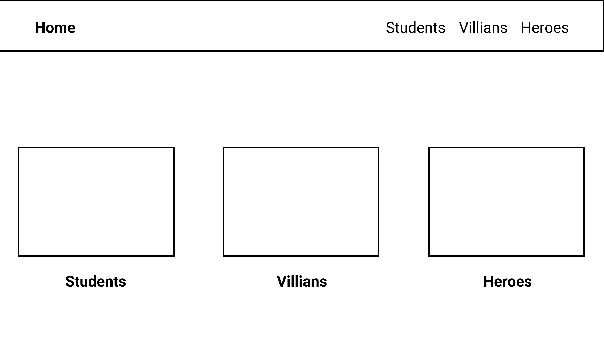
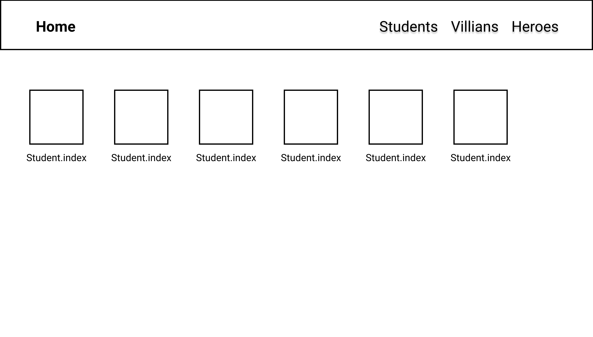
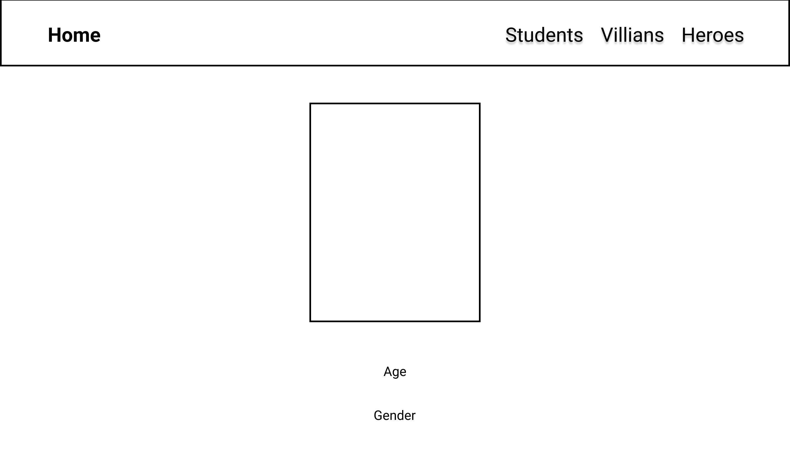
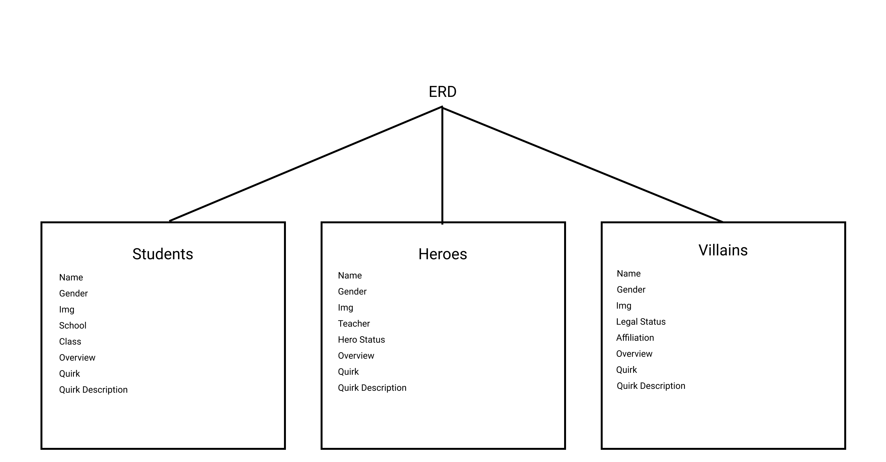

# This Project Resembles a Wiki page of The Anime TV series My Hero Academia.

## Project Overview

This Project is a MVP(Minimun Viable Product), that was created using Mongodb, Express, Handlebars and Node.js. The focus of this project was to show a working knowledge of Models-Views-Controllers. In this Web application, their are three Models that will define properties of three different types of characters from the show, Students, Heros and Villains. The home page of the application contains links in the navbar and on the three images to each route. each model has their own set of routes(controller) that show a page with all the characters and then a route to a specific characters information page. that navbar is set in the layout(view). so each model can accessed from the links in the navbar.
    The planning process involved wireframing, where a simple design of what each page should look like was made. Also included ERD with the wireframe to show the schema relationships, in this case the schemas were not related and had some different properties. I used trello guide my way through the project by making a todo list for each part of the project I was doing.

   ## Here are my Wireframe Screeenshots

   
   
   

   ## Here is my ERD Screenshot
   

   
